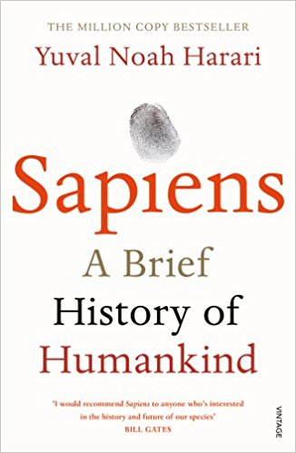
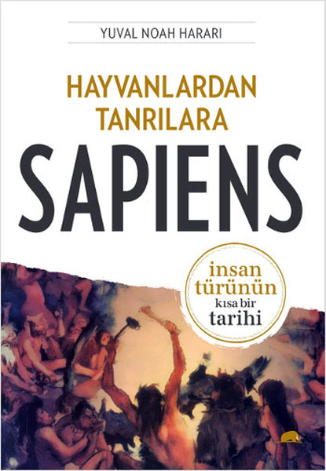

## Hayvanlardan Tanrılara
# Sapiens

  - Homo sapiens neden ekolojik bir seri katile dönüştü?
  - Para neden herkesin güvendiği tek şey?
  - Kadınlar üstün sosyal becerilere sahipken, neden çoğu toplum erkek egemen?
  - Güç elde etmekte böylesine yetenekli olan insanlar neden bu gücü mutluluğa dönüştürmekte başarısızlar?
  - Geleceğin dini bilim mi?
  - İnsanların miadı çoktan doldu mu?

--

  - 1976 Israil doğumlu bir tarihçi
  - 2002'de Oxford'dan PhD'sini almış
  - Şu anda Hebrew University of Jerusalem'de tarih departmanında ders vermekte
  - İki defa Polonsky yaratıcılık ve orjinallik ödülü almış (2009, 2012)
  - 2014 ve 2016'da sırasıyla Sapiens ve Homo Deus yayımlanmış ve bu kitaplar büyük övgüler almış

--

<section>
    
    
</section>

--

- Bilişsel Devrim:
  - Önemsiz bir hayvan
  - Bilgi ağacı
  - Adem ve Havva'nın bir günü
  - Sel

--

- Tarım Devrimi:
  - Tarihin en büyük aldatmacası
  - Piramitleri inşa etmek
  - Fazla dolu hafıza
  - Tarihte adalet yoktur

--

- İnsanoğlunun Birleşmesi:
  - Tarihin oku
  - Paranın kokusu
  - Emperal vizyonlar
  - Dinin kanunu
  - Başarının sırrı

--

- Bilimsel Devrim:
  - Cehaletin keşfi
  - Bilimle imparatorluğun evliliği
  - Kapitalist itikat
  - Sanayinin çarkları
  - Kalıcı bir devrim
  - Ve sonsuza dek mutlu yaşadılar
  - Homo Sapiens'in sonu

--

- Tanrılaşan Hayvan
